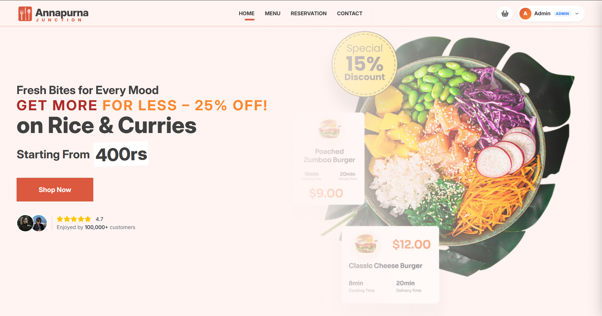
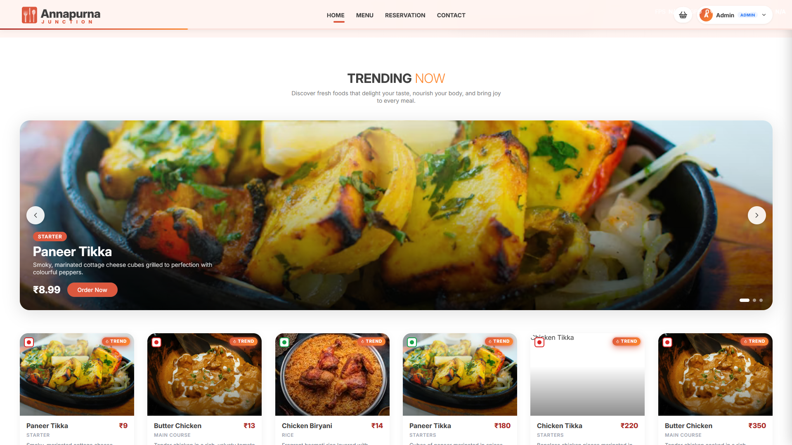
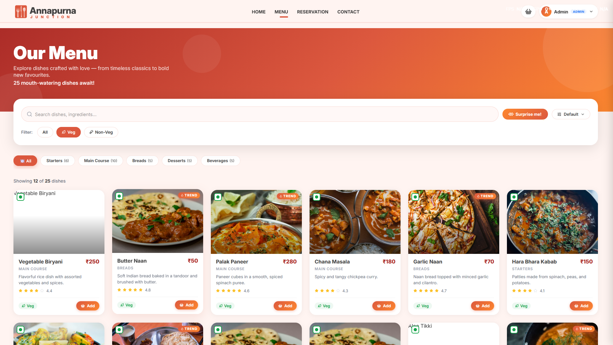
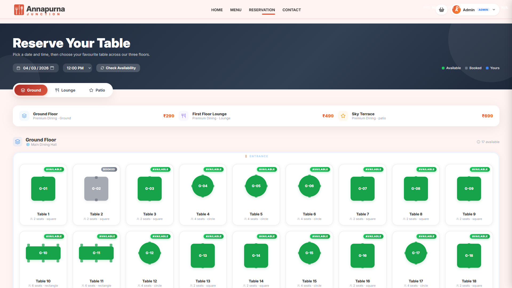
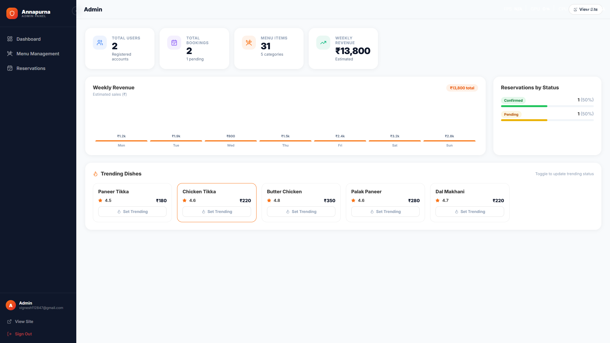
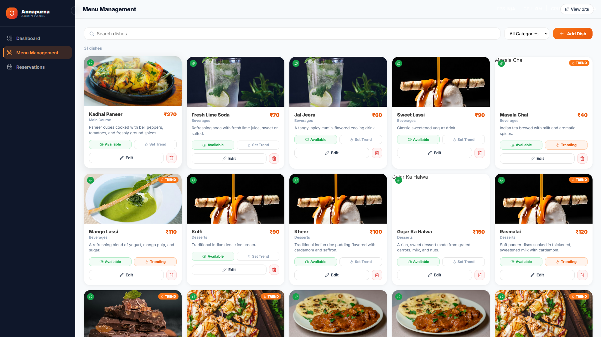
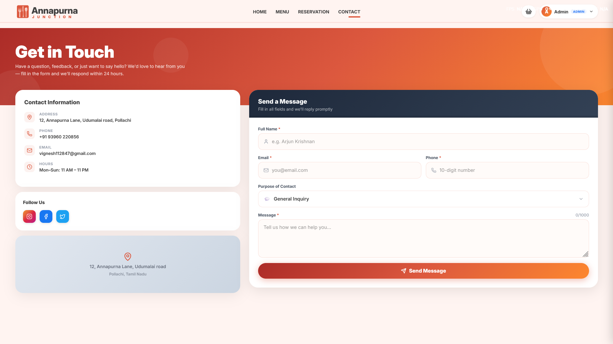
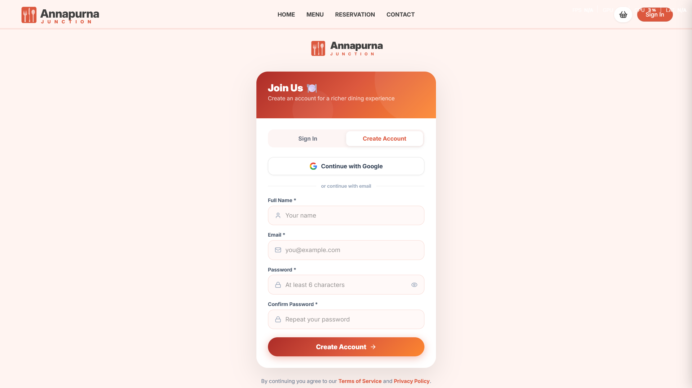

# 🥗 Annapurna - Indian Restaurant Management System

Annapurna is a full-stack modern restaurant management application designed to handle menu browsing, table reservations, and administrative tasks like menu management and analytical dashboards.

## ✨ Features

- **Dynamic Menu**: Categorized menu with real-time status (Veg/Non-Veg, Trending, Availability).
- **Interactive Table Reservation**: Visual table layout across multiple floors (Ground, Lounge, Patio) with real-time availability checking.
- **Admin Dashboard**: 
  - Real-time analytics (Weekly revenue, booking counts, trending dishes).
  - Menu Management (CRUD operations with Cloudinary image upload).
  - Reservation Management (Update status: Pending, Confirmed, Completed, Cancelled).
- **Authentication**: Secure login using Google OAuth 2.0.
- **Responsive Design**: Premium aesthetics with smooth animations and glassmorphism effects.

## 🛠️ Tech Stack

- **Frontend**: React.js, TypeScript, Vite, Lucide React, Axios, CSS Variables (Design System).
- **Backend**: Node.js, Express, TypeScript, Mongoose.
- **Database**: MongoDB Atlas.
- **Authentication**: Passport.js (Google Strategy), JWT.
- **Cloud Storage**: Cloudinary (for menu item images).

---

## 🚀 Getting Started

### Prerequisites

- [Node.js](https://nodejs.org/) (v16+ recommended)
- [MongoDB Atlas](https://www.mongodb.com/cloud/atlas) account
- [Cloudinary](https://cloudinary.com/) account
- [Google Cloud Console](https://console.cloud.google.com/) project (for OAuth)

### 1. Clone the Repository
```bash
git clone https://github.com/lightning4747/Restaurant.git
cd Restaurant
```

### 2. Backend Setup
Navigate to the server directory and install dependencies:
```bash
cd server
npm install
```

Create a `.env` file in the `server` directory:
```env
PORT=8000
NODE_ENV=development
MONGO_URI=your_mongodb_connection_string
JWT_SECRET=your_jwt_secret
JWT_EXPIRES_IN=7d

# Google OAuth
GOOGLE_CLIENT_ID=your_google_client_id
GOOGLE_CLIENT_SECRET=your_google_client_secret
GOOGLE_CALLBACK_URL=http://localhost:8000/api/auth/google/callback

# Cloudinary
CLOUDINARY_CLOUD_NAME=your_cloud_name
CLOUDINARY_API_KEY=your_api_key
CLOUDINARY_API_SECRET=your_api_secret

# URLs
CLIENT_URL=http://localhost:5173
FRONTEND_URL=http://localhost:5173

# Admin Initial Setup
ADMIN_EMAIL=admin@example.com # vignesh112847@gmail.com
ADMIN_PASSWORD=admin_password # vignesh1128
// included the admin and admin mail for test purposes
```

**Seed the Database:**
```bash
# Seed Menu Categories and Items
npm run seed

# Seed Table Layout (Ground, Lounge, Patio)
npm run seed:tables
```

**Start the Backend:**
```bash
npm run dev
```

### 3. Frontend Setup
Navigate to the client directory and install dependencies:
```bash
cd ../client
npm install
```

Create a `.env` file in the `client` directory:
```env
VITE_API_URL=http://localhost:8000/api
VITE_GOOGLE_MAPS_API_KEY=your_google_maps_api_key
```

**Start the Frontend:**
```bash
npm run dev
```

---

## 🔑 Key API Keys & Configuration

| Service | Purpose | Where to get |
|---------|---------|--------------|
| **MongoDB Atlas** | Database | [mongodb.com](https://www.mongodb.com/) |
| **Google OAuth** | Login | [Google Cloud Console](https://console.cloud.google.com/) |
| **Cloudinary** | Image Uploads | [cloudinary.com](https://cloudinary.com/) |
| **Google Maps** | Contact Page | [Google Cloud Console](https://console.cloud.google.com/) |

---

## 📸 Screenshots

### Home Page


### Trending Dishes


### Full Menu


### Table Reservation Plan


### Admin Analytical Dashboard


### Menu Management (Cloudinary Integration)


### Contact & Location


### Authentication



